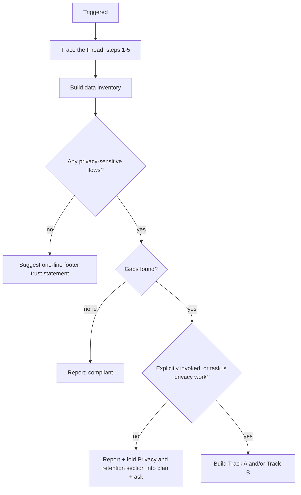

# Privacy by Design

Every app that touches privacy-sensitive data ships two artifacts — a user-facing privacy section and a "Data" section in its CONTEXT.md — and every stored privacy-sensitive entity has an explicit retention state. The pattern is proven end to end by Lumen (`apps/prompt-engineering`) and its stats backend (`apps/dashboard`); this skill codifies it for every app in the repo.

## Scope: privacy-sensitive data only

This skill applies to: tracking/analytics events, pseudonymous IDs, sessions, personal data transmitted by forms, identifying cookies or localStorage keys, and third-party embeds that receive user data. Plain business data with no personal component is out of scope.

## Core invariant: three retention states

Every privacy-sensitive entity in the data inventory ends in exactly one state:

1. **TTL** — the purpose is time-bounded (analytics rows, sessions, verification codes, holds).
2. **Documented no-TTL** — a written justification in CONTEXT.md plus a deletion or anonymization path (active accounts, legally retained records, commercial records).
3. **Provably anonymous** — aggregates with no identifier, like the dashboard's `COUNTER` rows; no TTL needed.

**Consistency rule**: every privacy-section claim is backed by code, in both directions. "Deleted after 90 days" requires an actual 90-day TTL — including historical rows (see Track B step 3). And retention behavior that exists in code must be stated in the privacy section.

## Hard guardrails (non-negotiable)

1. **NEVER suggest TTL on commercial or operational records** — webshop items, products, orders, sales, invoices, payments, appointments, customer accounts, tenant/business configuration — even when they contain personal data. Those belong in state 2: documented no-TTL plus a deletion/anonymization path. TTL is for tracking data only: analytics events, pseudonymous visitor rows, sessions, verification codes, temporary holds.
2. **Agents never deploy infrastructure.** Track B edits CDK code and runs `cdk synth` / `cdk diff` only; the user deploys (repo no-infra-deploys rule).
3. **Report, then ask.** When the audit finds gaps outside the current task's scope: report them, fold a "Privacy & retention" section into any plan being written, and ask before building fixes. Build without re-asking only when this skill was explicitly invoked or the task already is privacy work. Never silently auto-fix privacy gaps mid-unrelated-task.

## Activation threshold

Any privacy-sensitive flow triggers the full two-artifact requirement — analytics even when pseudonymous, forms transmitting personal data even when nothing is stored, identifying cookies/localStorage, third-party services receiving user data. For an app with zero such flows, suggest a one-line footer trust statement instead (style model: `footer.note` in `apps/prompt-engineering/js/i18n/en.js` — "Your journal and prompts stay in this browser...").

## Audit workflow: find the thread

Trace in this order:

1. `CONTEXT-MAP.md` and the app's `CONTEXT.md` — is there a "Data" section already? Which flows are documented?
2. Footer and i18n files (`js/i18n/en.js` / `nl.js` or the app's equivalent) — does a privacy link or privacy section exist?
3. Frontend: forms, `fetch`/POST calls, localStorage/cookie writes, analytics snippets, third-party scripts.
4. Backend write paths (repositories, Lambda handlers) — which attributes are personal or pseudonymous?
5. CDK table definitions under `infra/cdk/` — is `TimeToLiveAttribute` set?
6. Produce the data inventory:

| Flow | Data | Privacy-sensitive? | Purpose | Retention state | Page claim |
|------|------|--------------------|---------|-----------------|------------|
| Lumen beacon to /api/events | `lumen.vid` UUID, event type | yes | usage funnel | 1 — 90-day TTL | "deleted after 90 days" |
| Dashboard `COUNTER` rows | aggregate counts, no id | no — anonymous | stats | 3 | n/a |
| Portfolio contact form | name, email, message | yes | contact relay | relayed by email, nothing stored | missing — no privacy section |

(The first two rows are the compliant golden path; the third is a real gap: `apps/mikepattyn` relays contact submissions by email after Turnstile verification and stores nothing server-side, but ships no privacy section saying so. `apps/kapsalon` is the larger known gap — customer personal data in DynamoDB, zero privacy/GDPR/AVG mentions; as commercial records its rows need state-2 documentation plus a privacy section, not TTL.)

Then route:



## Track A — privacy section

Two artifacts, bound by the consistency rule.

**1. User-facing privacy section.** Plain language covering: what is collected, why, where it goes, retention period, opt-out when applicable, and contact. EN/NL via the app's i18n convention, linked from the footer. Golden path — Lumen's `#/privacy` route:

- `apps/prompt-engineering/js/app.js` — `privacyView()`, the `#/privacy` hash route, `wirePrivacy()` opt-out checkbox, footer link wiring
- `apps/prompt-engineering/js/i18n/en.js` and `apps/prompt-engineering/js/i18n/nl.js` — the `privacy` section and `footer.privacyLink`
- `apps/prompt-engineering/js/analytics.js` — opt-out honored at send time (`lumen.analytics.optout` in localStorage; every event send checks it first)

**2. Internal "Data" section** in the app's `CONTEXT.md`, listing each privacy-sensitive flow and its retention decision. Model: the Data section of `apps/dashboard/CONTEXT.md` (identifiers, event types, TTL, opt-out, backfill pointer — all in a few lines).

## Track B — TTL adoption (four steps, in order)

1. **CDK**: set the TTL attribute on the table — one line in `TableProps`: `TimeToLiveAttribute = "ttl"`. Template: `infra/cdk/Mikepattyn.CDK.Constructs/Stacks/Dashboard/DashboardBackendStack.cs`. Edit and run `cdk synth` / `cdk diff` only; the user deploys.
2. **Write paths**: stamp `ttl` (epoch seconds) on all new AND updated privacy-sensitive items, e.g. `ttl: Math.floor(Date.now() / 1000) + 90 * 24 * 60 * 60` — the pattern in `infra/cdk/Mikepattyn.CDK/lambda/dashboard/index.js`. DynamoDB is schemaless: existing items gain the attribute on their next update, no migration needed for actively touched rows.
3. **Backfill pre-existing rows**: rows that never get updated stay immortal, which makes the privacy section false for historical data. Generate a one-off, dry-run-first scan+update tool under `tools/` that the USER runs with production credentials. Model: `tools/dashboard-backfill-ttl/` (`README.md` and `backfill-ttl.js` — `--dry-run` flag prints intended updates first; aggregate rows untouched).
4. **Docs sync in the same change**: update the CONTEXT.md Data section and the privacy section claims together with the code, never in a follow-up — that is how claims and code stay in lockstep.

## Default retention matrix

Starting values; final numbers stay per-app decisions recorded in CONTEXT.md.

| Data | Default retention | Notes |
|------|-------------------|-------|
| Pseudonymous analytics/tracking events | 90 days | Lumen precedent |
| Sessions, auth tokens | hours to days | |
| Verification codes | minutes to hours | |
| Temporary holds, carts | hours to days | |
| Logs containing identifiers | 30-90 days | |
| Contact-form submissions relayed by email, not stored server-side | no TTL needed | privacy section must state that nothing is stored |
| Commercial/operational records | state 2 — never TTL | documented justification + deletion/anonymization path |

## Plan gate

Any plan that touches data storage must contain a "Privacy & retention" section: the data-inventory delta (new or changed flows) and the retention decision for each. A plan missing this section is incomplete.

## DynamoDB single-table notes

- TTL deletes whole items; an item is one entity row. Keep aggregates as separate anonymous items (the `COUNTER` row pattern) so expiring identified rows never destroys aggregate stats.
- TTL deletion is eventually consistent — typically within 48 hours after expiry. Never rely on TTL for security-critical expiry.
- Expired-but-unreaped items still appear in scans and queries; filter on the `ttl` attribute when correctness matters.
- TTL deletes replicate to GSIs automatically.

## Summary checklist

Before finishing any task that touched privacy-sensitive data:

```
- [ ] Data inventory produced (flow, data, sensitive?, purpose, retention state, page claim)
- [ ] Every privacy-sensitive entity in exactly one state: TTL / documented no-TTL / anonymous
- [ ] No TTL suggested on commercial or operational records
- [ ] Privacy section exists (EN/NL, footer link) and matches code in both directions
- [ ] CONTEXT.md "Data" section lists every flow + retention decision
- [ ] TTL adoption followed all four steps (CDK, write paths, backfill, docs sync)
- [ ] No infrastructure deployed; user runs cdk deploy and any backfill tool
- [ ] Plan (if any) contains a "Privacy & retention" section
- [ ] Gaps outside task scope: reported and asked, not silently fixed
```
